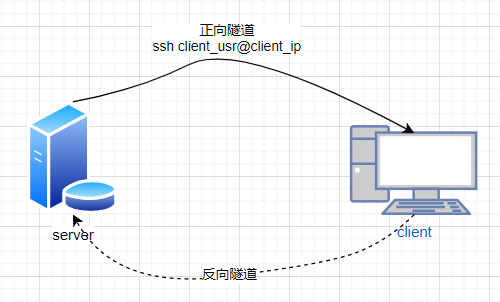
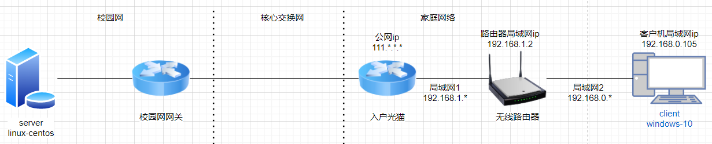
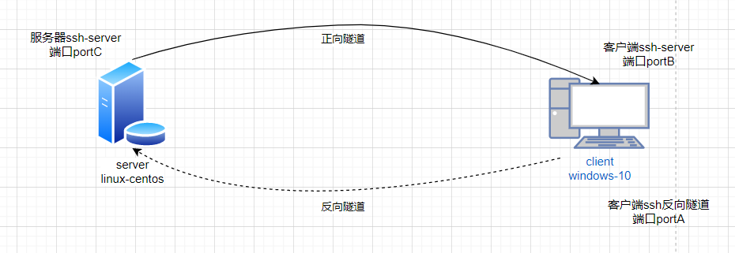
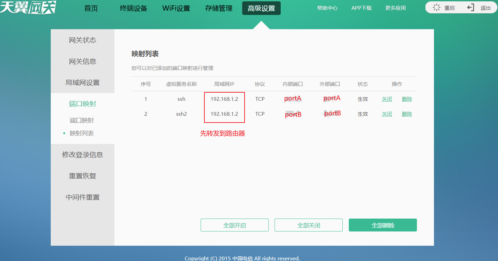
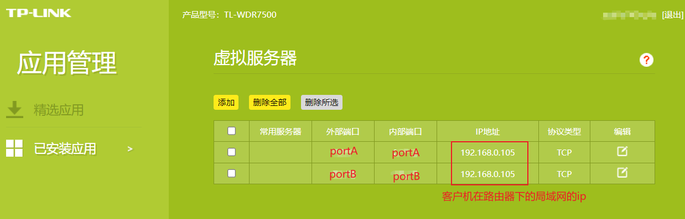
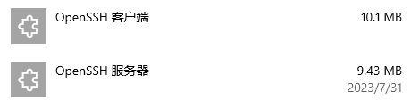
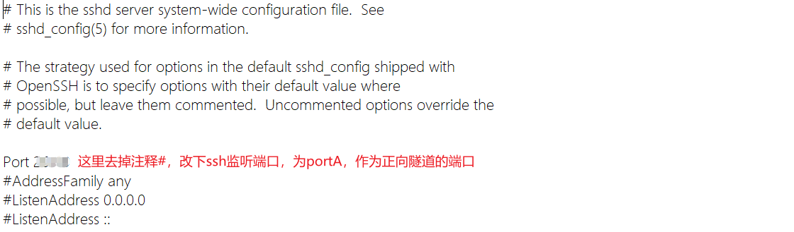
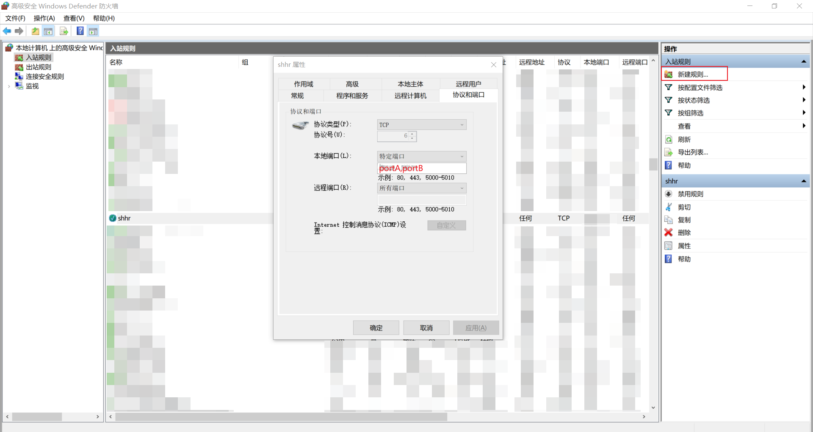
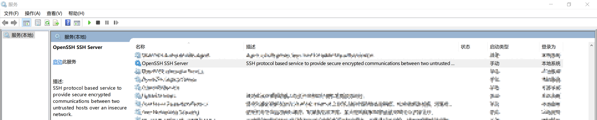

# SSH-ReverseTunnel-Tutorials

通过ssh反向隧道实现内网穿透的教程

## 需求

由于校园网的严格规则，导致外网无法直接访问校园网内的服务器。

我已知的解决这一问题的方案有三种：

1.~~成为管理员，直接顶风作案。~~

2.使用cploar或花生壳这类内网穿透工具进行流量转发，但流量有限额 ~~(贵)~~，而且慢。

3.使用ssh反向隧道。

## 原理

由于我们的服务器在校园网内，有一层NAT，因此从外网无法直接访问，但是局域网内的服务器可以向外通信，ssh为TCP链接，当从服务器向客户机建立连接后，即可进行双向通信。

与传统的ssh直接连接不同的是，不是由客户机向服务器的连接，而是相反，在建立正向隧道的同时建立反向隧道，便于客户机访问服务器。

## 步骤

### 初始时 网络拓扑图

这里以我的家庭网络为例，网络拓扑如下图。

### 申请客户机公网ip

为了使得服务器能够连接到客户机，需要知道客户机的公网ip。这里考虑过使用ipv6，但是服务器的ipv6网关不是很完善且没有root权限不好搞，遂放弃。

我是用的是电信宽带，直接打客服申请公网ip，几分钟就有片区维修人员打电话过来确认，远程开通了公网ip。（记得重启光猫）

### 端口映射

**!注意暴露端口有被攻击的风险，请自负后果!**

首先规定两个端口，portA作为正向隧道的端口，portB作为反向隧道的端口，需要将这两个端口在入户光猫和无线路由器都做端口映射，转发到我们的客户机。

还有一个portC是指的服务器的ssh-server端口，默认22。

首先在光猫上添加端口映射规则，先将portA/B的数据都转发到路由器。

再到路由器上添加端口映射规则，将portA/B的数据转发到客户机。新版TP路由器也叫做虚拟服务器。

### 客户机windows安装openssh-server

设置->应用->可选功能->添加功能->安装openssh。

就是安装下图这两玩意。

### 配置客户机ssh-server

windows下的sshd配置文件默认在C:\ProgramData\ssh\sshd_config

改ssh-server的端口，为portB。（哪个端口正向哪个端口作反向随意，对应就行）

### 配置客户机windows防火墙

如果遇到无法访问的情况，多半是windows防火墙给拦截了，加一下入站规则。

### 启动客户机openssh-server

win+r打开运行->输入services.msc后回车，打开服务->找到openssh server->右键启动

### 校内服务器开启反向隧道连接

想办法进入校内服务器终端，我是通过课题组提供的有流量限额的校外通道进去的，只需要连接配置指令的流量，后续使用走隧道，不走穿透流量。

进入后输入指令 `ssh -R portA:localhost:portC 客户机用户名@公网ip -p portB`

详细的指令如背景运行等参见 [https://www.freesion.com/article/20251564670/](https://www.freesion.com/article/20251564670/)

然后会提示输入密码，这个密码是windows的账户密码，我是在线账户，所以用的微软密码登陆。

window的用户名可以在cmd中输入指令whoami，斜杠后面的就是登陆用的用户名。

登陆成功后，成功从服务器访问客户机，并创建反向隧道。

### 客户机连接服务器

此时在客户机中的登陆信息如下：

    用户名：服务器用户名，就是以前直接ssh到linux的登录名，不是windows的登录名。

    ip：localhost

    port：portA，反向隧道的端口。

    密码：服务器的密码，就是以前直接ssh到linux的密码，不是windows的密码。

通过指令 `ssh linux_usr_name@localhost -p portA` 然后输入密码就完成了登陆到服务器。

## 备注

### DDNS

由于公网ip隔一段时间可能会发生变化，所以建议在路由器或客户机中设置DDNS，服务器那边的连接直接用域名，方便连接。

### 持久化运行

这篇 [博客](https://www.freesion.com/article/20251564670/)交代了持久化的方式，但是我没有root权限，麻烦。

我们用的是slurm作业调度系统，所以直接交个作业提交这个指令，出了问题直接杀作业就行，简单易行。

### 密码安全

为了安全起见，建议使用ssh免密登陆，并只允许密钥登陆。ssh免密教程挺多的。

免密失败错误排查博客 [https://www.codenong.com/cs107672001/](https://www.codenong.com/cs107672001/), 尤其是文件权限!